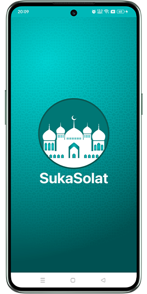
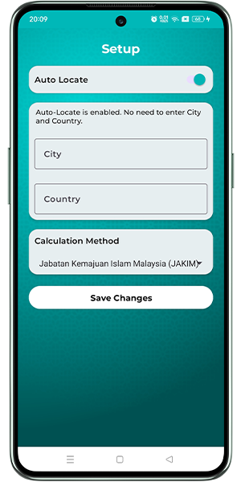
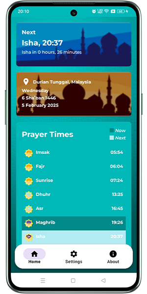
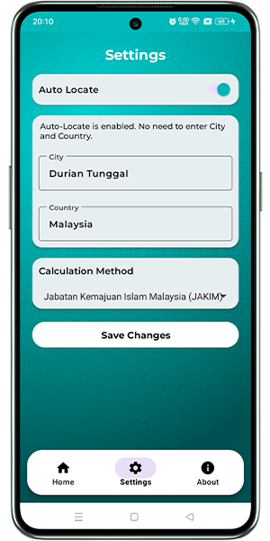
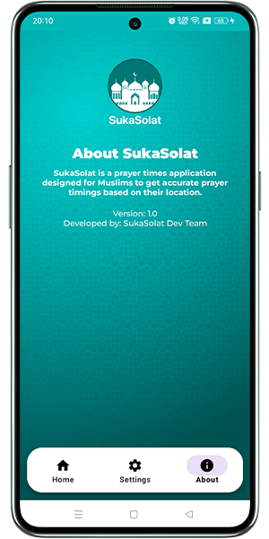

#   
## **SukaSolat: A Prayer Times Application for Muslims** ⏰🕌🕋🤲🏻🌙

---

## **Overview**  
SukaSolat is an Android application designed to provide accurate prayer times for Muslims based on their location or manually entered city/country. The app supports features like auto-location detection, customizable calculation methods, and displays both Gregorian and Hijri dates. It also highlights the current and next prayer time and provides a user-friendly interface for managing settings. 📍🕌

This app is built using modern Android development practices, including the **MVVM architecture**, **Room Database** for local storage, **WorkManager** for background tasks, and **Retrofit** for API integration with the [Aladhan API](https://aladhan.com/prayer-times-api). 🔧📱

---

## **Features**  
- **Accurate Prayer Times**: Fetches prayer times using the Aladhan API. ⏰  
- **Auto-Location Detection**: Automatically detects the user's location to fetch prayer times. 🌍  
- **Manual Input**: Allows users to enter their city and country manually. 🏙️  
- **Customizable Calculation Methods**: Supports multiple prayer time calculation methods (e.g., Muslim World League, Umm Al-Qura, etc.). 📊  
- **Gregorian and Hijri Dates**: Displays both Gregorian and Hijri dates on the main screen. 📅  
- **Current & Next Prayer Time Highlighting**: Highlights the current & next prayer time and shows the remaining time. ⏳  
- **Background Task**: Uses `WorkManager` to fetch prayer times in the background. 🕒  
- **Local Storage**: Stores prayer times locally using Room Database for offline access. 💾  
- **User Preferences**: Saves user preferences (e.g., city, country, calculation method) using `SharedPreferences`. ⚙️

---

## **Installation**  

### **Prerequisites**  
- **Android Studio**: Latest version recommended. 💻  
- **Java Development Kit (JDK)**: Version 11 or higher. ☕  
- **Android Device or Emulator**: API level 21 or higher. 📱

### **Steps to Run the App**  
1. **Clone the Repository**:  
   ```bash
   git clone https://github.com/harraz-shukri-dev/SukaSolat.git
   ```

2. **Open the Project in Android Studio**:  
   - Launch Android Studio.  
   - Select **"Open an Existing Project"** and navigate to the cloned folder.

3. **Set Up Dependencies**:  
   - Ensure all required dependencies are installed. Add the following libraries to your `build.gradle` file:  
     ```gradle
      implementation 'com.google.android.material:material:1.9.0'
      implementation 'androidx.lifecycle:lifecycle-livedata-ktx:2.6.1'
      implementation 'androidx.lifecycle:lifecycle-viewmodel-ktx:2.6.1'
      implementation 'androidx.room:room-runtime:2.5.2'
      annotationProcessor 'androidx.room:room-compiler:2.5.2'
      implementation 'com.squareup.retrofit2:retrofit:2.9.0'
      implementation 'com.squareup.retrofit2:converter-gson:2.9.0'
      implementation 'androidx.work:work-runtime:2.8.1'
      implementation 'androidx.navigation:navigation-fragment:2.5.3'
      implementation 'androidx.navigation:navigation-ui:2.5.3'
      implementation 'com.google.android.gms:play-services-location:21.0.1'
     ```

4. **Run the App**:  
   - Connect an Android device or start an emulator.  
   - Click the **"Run"** button in Android Studio to build and deploy the app.

---

## **Usage**  

### **1. Splash Screen**  
When the app starts, the **Splash Screen** is displayed briefly. It transitions to either the **Setup Screen** (if the user is launching the app for the first time) or the **Main Screen** (if the setup is already complete). 🌟

### **2. Setup Screen**  
- If the app detects that the user has not completed the initial setup (e.g., no saved preferences in `SharedPreferences`), it navigates to the **Setup Screen**.  
- **Purpose**: The **Setup Screen** allows users to configure their preferences:  
  - **Auto-Location Toggle**: Enable or disable automatic location detection. 📍  
  - **City and Country Input**: If auto-location is disabled, users can manually enter their city and country. 🌆  
  - **Calculation Method Selection**: Users can choose a prayer time calculation method from a dropdown menu. 📐  
- **Save Button**: After configuring the settings, users can click the **Save Changes** button to store their preferences in `SharedPreferences`. The app then navigates to the **Main Screen**.

### **3. Main Screen**  
- Displays a list of prayer times for the day. ⏰  
- Highlights the current and next prayer time and shows the remaining time. ⏳  
- Shows the user's location (city and country) and the current Gregorian/Hijri date. 🗓️

### **4. Settings Screen**  
- Allows users to update their preferences at any time:  
  - Enable/disable auto-location detection. 🌍  
  - Enter or update city and country. 🏙️  
  - Select a different prayer time calculation method. 📈

### **5. About Screen**  
- Provides information about the app, including its version and developer details. 📜

---

## **Code Structure**  
The app follows the **MVVM (Model-View-ViewModel)** architecture for better separation of concerns. Below is a breakdown of the key components:

### **Activities**
1. **MainActivity.java**:  
   Displays prayer times, current and next prayer info, and user location. Handles navigation via `BottomNavigationView`. 🧭

2. **SettingsActivity.java**:  
   Allows users to configure preferences like city, country, auto-location toggle, and calculation method. ⚙️

3. **SetupActivity.java**:  
   Guides users through initial setup. 🛠️

4. **AboutActivity.java**:  
   Displays app information. ℹ️

5. **SplashActivity.java**:  
   Displays the splash screen. ✨

### **Adapters**
1. **PrayerTimeAdapter.java**:  
   Handles the RecyclerView for displaying prayer times. 📜

### **ViewModels**
1. **MainViewModel.java**:  
   Manages LiveData and interacts with the Repository. 🧠

### **Repositories**
1. **PrayerTimeRepository.java**:  
   Acts as an intermediary between the database and ViewModel. 🔄

### **Database**
1. **PrayerTimeDatabase.java**:  
   Defines the Room database schema. 🗄️

2. **PrayerTimeDao.java**:  
   Provides methods for inserting and retrieving data. 💾

3. **PrayerTime.java**:  
   Represents the table structure for storing prayer times. 🕰️

### **API**
1. **AladhanService.java**:  
   Retrofit interface for interacting with the Aladhan API. 🌐

2. **ApiClient.java**:  
   Sets up the Retrofit instance with the base URL and Gson converter. 🔧

### **Worker**
1. **FetchPrayerTimesWorker.java**:  
   Fetches prayer times in the background using WorkManager. 🔄

### **Models**
1. **PrayerTimeItem.java**:  
   Represents each prayer time entry in the RecyclerView. 📅

2. **PrayerTimesResponse.java**:  
   Models the API response from Aladhan. 📡

### **Utilities**
1. **PrayerTime.java**:  
   Represents the data structure for prayer times. ⏳

---

## **Screenshots**

### **1. Splash Screen**  
  

### **2. Setup Screen**  
  

### **3. Main Screen**  
  

### **4. Settings Screen**  
  

### **5. About Screen**  
  

---

## **Dependencies**  
The app uses the following libraries:  
- **Retrofit**: For API calls. 🔗  
- **Room Database**: For local storage. 💾  
- **WorkManager**: For background tasks. 🛠️  
- **Material Components**: For modern UI design. 🎨  
- **Google Play Services Location**: For fetching the user's location. 📍

Add these dependencies to your `build.gradle` file:  
```gradle

implementation 'com.google.android.material:material:1.9.0'
implementation 'androidx.lifecycle:lifecycle-livedata-ktx:2.6.1'
implementation 'androidx.lifecycle:lifecycle-viewmodel-ktx:2.6.1'
implementation 'androidx.room:room-runtime:2.5.2'
annotationProcessor 'androidx.room:room-compiler:2.5.2'
implementation 'com.squareup.retrofit2:retrofit:2.9.0'
implementation 'com.squareup.retrofit2:converter-gson:2.9.0'
implementation 'androidx.work:work-runtime:2.8.1'
implementation 'androidx.navigation:navigation-fragment:2.5.3'
implementation 'androidx.navigation:navigation-ui:2.5.3'
implementation 'com.google.android.gms:play-services-location:21.0.1'

```

---

## **Contributors**  
- **Muhammad Harraz Hilmi Bin Mohd Shukri** - Main Developer  
  Matric Number: B032410540  
  Email: razdevonline@gmail.com  
  Section/Group/Programme : S3/G2/BITS

- **Ahmad Taufiq Andriono** - Second Developer  
  Matric Number: B032410965  
  Email: b032410965@student.utem.edu.my  
  Section/Group/Programme : S1/G1/BITS
---

## **Acknowledgments**  
- Thanks to the [Aladhan API](https://aladhan.com/prayer-times-api) for providing accurate prayer times.  
- Thanks to the open-source community for libraries like Retrofit, Room, and WorkManager. 🙌

---
